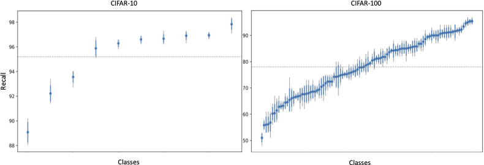

# Class Hardness Importance

## Quick Start

To reproduce the main experiments:

Case Study 1

> bash scripts/run_case_study_1_experiments.sh

Case Study 2

> bash scripts/run_case_study_2_experiments.sh

## Motivation

Even in balanced datasets such as CIFAR-10 or CIFAR-100, model performance can vary substantially across classes. 
Some classes are consistently harder to learn than others, leading to uneven classification accuracy.

This repository investigates whether dataset resampling strategies can be improved by accounting for **class hardness** 
rather than class frequency. Specifically, we explore *hardness-based resampling*, where harder classes are oversampled 
and easier classes are undersampled.

This shifts the focus from **class balance** to **hardness balance**, allowing us to study whether addressing the latter 
leads to improved model performance.

### Class performance disparities



## Experimental Design

The experimental pipeline is organized around **two case studies** that investigate the role of class hardness under different data availability scenarios.

Both case studies begin with **baseline ensemble training**, which provides the hardness estimates used in later stages.

### Step 1 — Baseline Model Training

Script: `train_baseline_models.py`

An ensemble of neural networks is trained on the original balanced dataset. During training we estimate **sample hardness**, which is later used to:

- perform dataset pruning
- estimate **class hardness**
- guide resampling strategies

The resulting hardness estimates are stored and reused by both case studies.

---

### Case Study 1 — Resampling with Holdout Set

Script: `case_study_1.py`

This experiment simulates a scenario where **limited subset of real data** is available.

The pipeline proceeds as follows:

1. **Holdout data for oversampling** - Dataset is randomly pruned at class-level with removed samples forming a *holdout set* that simulates access to additional real data.

2. **Hardness-based resampling** - We apply hardness-based resampling to the pruned subdataset using the holdout set for oversampling.

The goal of this case study is to compare models trained on:

- pruned datasets
- pruned datasets augmented with hardness-based resampling

---

### Case Study 2 — Resampling with Synthetic Data

Script: `case_study_2.py`

This experiment evaluates resampling strategies when large amounts of synthetic data are available.

Resampling is applied directly to the **full dataset** using several techniques, including:

- classical oversampling methods
- **EDM-generated synthetic data**

For EDM, we use a dataset containing **1 million synthetic samples** generated using the diffusion model from:

> (insert citation here)

The goal is to study whether introducing data imbalance via hardness-based resampling reduced performance disparities across classes.

## Repository Structure


### Directory description

- **scripts/** - Bash scripts used to run complete experimental pipelines.

- **src/analysis** - Scripts used to analyze results, perform statistical tests, and generate figures (Fig. 1, Fig. 2, Fig. 3, and Fig. 7).

- **src/config** - Configuration files controlling experiment settings.

- **src/data** - Dataset loading and simple preprocessing (not pruning or resampling) utilities.

- **src/experiments** - Main experimental modules used in the paper.

- **src/hardness** - Methods used to estimate sample hardness.

- **src/models** - Modified ResNet18 for CIFAR-10 and CIFAR-100 and related utilities for loading pretrained models.

- **src/pruning** - Dataset pruning strategies.

- **src/resampling** - Dataset resampling strategies.

- **src/training** - Training utilities for neural network ensembles.

- **src/utils** - General helper functions used across modules.

- **src/visualization** - Functions used to generate figures (Fig. 5, Fig. 6, and Fig. 8) and tables (appendix).

## Running Experiments

The most basic experimental pipelines can be executed using the provided scripts in the `scripts/` directory. The 
complete pipeline can be executed using the provided scripts in the `scripts/slurm/` directory; specifically, 
`case_study_1_full_pipeline.sh` and `case_study_2_full_pipeline.sh`.

### Case Study 1

> bash scripts/run_case_study_1_experiments.sh

This script performs the following steps:

1. Train baseline ensemble models and estimate sample hardness.
2. Run pruning experiments.
3. Optionally perform hardness-based resampling.
4. Generate visualizations and statistical analyses.

---

### Case Study 2

> bash scripts/run_case_study_2_experiments.sh


This script runs the resampling experiments on the full dataset, including experiments using synthetic data.

### Pipeline Diagram
```text
                                 Baseline Training
                                        │
                                        ▼
                              Hardness Estimation
                                        │
                                        ▼
                  ┌────────────────────────────────────────────┐
                  │                                            │
                  ▼                                            ▼
              Case Study 1                                 Case Study 2
               (Pruning)                                   (Resampling)
                  │                                            │
                  ▼                                            ▼
   Pruned Dataset vs Pruned + Resampled           Full Dataset vs. Resampled
```

## Experimental Robustness

To obtain statistically reliable results, the experiments account for two sources of randomness:

1. **Model initialization randomness**
2. **Dataset generation randomness** (caused by pruning or resampling)

To control for both sources, the experiments follow a two-level design:

- Multiple **dataset variants** are generated using different random seeds.
- For each dataset variant, an **ensemble of models** is trained.

This results in a grid-like experimental setting:

| Setting | Description |
|-------|-------------|
| 1×1 | One dataset variant, one trained model |
| 2×2 | Two dataset variants, two models per dataset |
| 4×4 | Four dataset variants, four models per dataset |

For example, the **4×4 configuration** used in the paper means:

- 4 independently generated dataset variants (e.g., resampling 4 times using different seeds)
- 4 models trained on each dataset variant  

This results in **16 trained models per experiment**.

This design allows us to:

- reduce variance caused by model initialization
- reduce variance caused by pruning/resampling randomness
- perform **paired statistical tests** when comparing experimental conditions.

The configuration can be adjusted in:

> src/config/config.py

Smaller settings such as **2×2** can be used for faster experimentation.

 
## Generating Figures

Figures from the paper are generated using scripts in `src/analysis` and
`src/visualization`.

### Figures 1, 2, 3, and 7

These figures are produced using standalone analysis scripts located in:

> src/analysis/

Example: 

> python -m src.analysis.plot_figure_1


These scripts generate the plots used in the paper. In some cases the scripts
produce individual components which were later combined into the final figures.

---

### Figures 5, 6, and 8

These figures are generated as part of the experimental pipelines for the two
case studies.

Running the experiment scripts will automatically generate the necessary
visualizations. The visualization logic used by these scripts is implemented in:

> src/visualization/figures.py

The scripts produce figure components that were combined to obtain the final
figures used in the paper.


## Citation

TBD